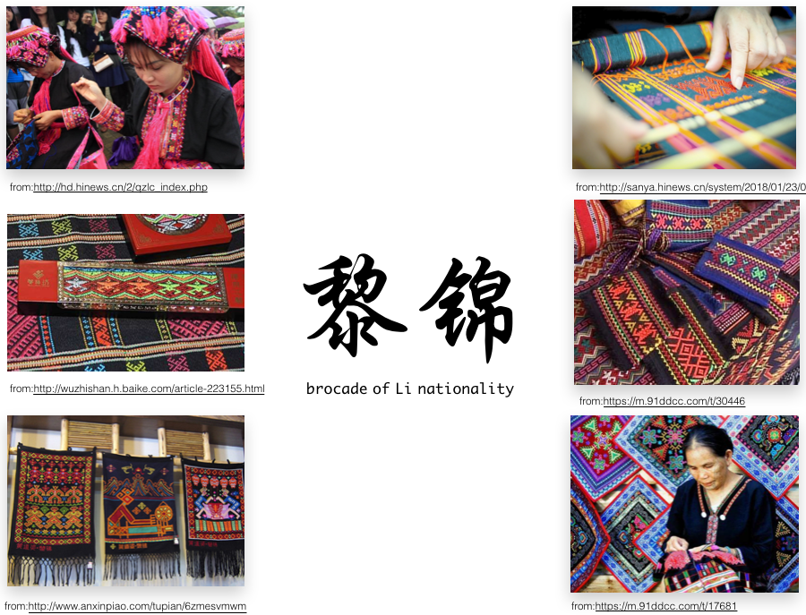
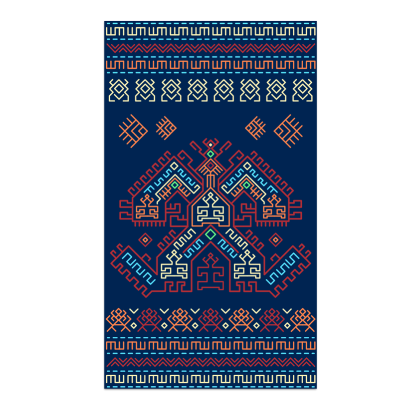

## 黎风 | Li Style

这是一个黎族织锦的游戏。黎族有着三千年的历史，黎锦是世界非物质文化遗产之一，黎锦纺织技术通过黄道婆的改造影响后，进而提升了古代中国的纺织技术。在这个 Playground 中你可以体验到黎锦最核心的内容，在第一部分我将给你展示黎族的守护神之一“大力神”的神奇面貌，第二部分你可以使用内置的一些黎族标志，如动物、天气、食物等构建属于你自己的黎锦。

This is a game of Li brocade. The Li nationality has a history of 3,000 years. Li brocade is one of the world's intangible cultural heritages. After the influence of the transformation of Huang Daopo, Li brocade textile technology has enhanced the textile technology of ancient China. In this Playground, you can experience the core of Li Jin. In the first part, I will show you the magical features of one of the patron saints of the Li nationality. In the second part, you can use some of the built-in Li brocade logos, such as animals, weather, food, etc. build yourself Li brocade. Hope you like it!

